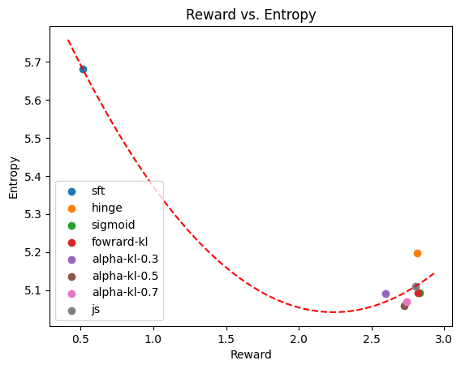

# Language Model Alignment

Тестовое задание в Tinkoff Lab, 2023

Весь код созания датасета и обучения находится в solution.ipynb. Как бы мне не хотелось самому оформить все это в скрипты, в колабе ими пользоваться очень неудобно(

## Введение

Способы alighment-а языковых моделей, на мой взгляд, лучше всего обобщаются в статье [Statistical Rejection Sampling Improves Preference Optimization](https://arxiv.org/abs/2309.06657).

3 основных алгоритма, [RLHF](https://arxiv.org/abs/1706.03741), [DPO](https://arxiv.org/abs/2305.18290), [SLiC-HF](https://arxiv.org/abs/2305.10425) отличаются в первую очередь тем, из какой политики семплируют примеры для обучения. RLHF семплиурет из текущей обучаемой политики, ранжирует ревард моделью, и учится дальше с помощью RL и PPO. SLiC-HF семплирует из SFT-политики (оффлайн), ранжирует ревард моделью, и учится на этом. DPO ниоткуда не семплирует и не использует ревард модель, он берет готовые примеры из какой-то неизвестной (изначально *настоящей*) политики, уже отранжированные *настоящей* людской ревард-моделью, и обучается только на этом. RSO предлагает семплировать из оптимальной политики, применяя rejection sampling.

Еще одно отличие между DPO и SLiC это лосс. У DPO это логистический лосс на специальных относительных логитах, полученный аналитически из обжектива RLHF, тогда как в оригинальном SLiC это hinge loss на простых логитах.
Изначально там еще KL-регуляризация, но статья RSO предлагает от нее отказаться, и заменить логиты на нормализованные логиты, получив по сути DPO но с hinge-loss SVM-а вместо логистического. Этот вариант и имплементирован в [trl](https://github.com/huggingface/trl) под названием loss="hinge".

Задача этого задания - дообучить SFT модель (GPT-2) генерации отзывов к фильмам так, чтобы отзывы получались максимально положительными. При этом предлагается  использовать обученную ревард-модель, и составить датасет офлайн, на основе отранжированных генераций из SFT-модели. Таким образом, мы повторяем идею SLiC, но обучая в этом пайплайне также и сигмоид-лосс, и его вариации с другими KL-дивергенциями ([f-DPO](https://arxiv.org/abs/2309.16240v1)).

## Сетап экспериментов

Выбор некоторых параметров для обучения был довольно неочевиден и не очень ясно раскрывался в статьях.
Во-первых, неочевидно как должен выглядеть датасет для здачи генерации отзывов. 2 варианта - это либо генерировать их *безусловно*, то есть $\pi(y|BOS)$, либо беря в качестве промпта какое-то количество слов из оригинального SFT датасета, что больше похоже на стандартные сценарии саммаризации или диалога, которые исследуются в статьях. В результате предварительных экспериментов выяснилось что генерация по промпту получается визуально лучше и более осмысленной, тогда как безусловные семплы довольно часто были очень короткими, либо начинались с пунктуации или маленьких букв (что странно). Интересная деталь, при этом, что средний ревард безусловной генерации был, как и наверно ожидается, равен примерно нулю (и ревард модель и SFT модель обучены на одном и том же абсолютно сбалансированном датасете), тогда как ревард условной модели положителен. В итоге, я нашел [пример](https://github.com/CarperAI/trlx/blob/main/examples/notebooks/trlx_sentiments.ipynb), в котором берут 4 первых слова как промпт, и использовал этот подход, так как он в целом ближе к тому, что обычно присутствует в литературе.

Второй вопрос - как собственно семплировать из политики (языковой модели). Об этом как будто редко говорят, а если говорят, то предлагают сложный сетап beam search. Здесь я принял решение использовать обычный семплинг, то есть $y_t \sim \pi(y|y_{1..t-1},x)$, с температурой 0.7. Такие семплы опять же получались лучше чем beam search (он часто начинал повторяться, что для него в целом характерно). К тому же, он гораздо медленнее, хотя это и не важно когда весь семплинг только оффлайн.

Еще одна деталь - композиция датасета - сколько примеров семплировать для каждого промпта. В статье SLiC-HF семплировали 4 и составляли из них одну пару по турнирной системе, в статье про RSO брали обе пары. Я использовал второй вариант. Возможно, стоило также поэкспериментировать с одной парой либо большим количеством.

Наконец, сколько данных брать в принципе? По идее, нужен весь датасет в 50к промптов, но для экономии времени и компюта я взял сабсемпл из 5к. Стоит сказть, что в целом в пайплайне еще куча гиперпараметров, начиная от непосредственно $\beta$ самого алгоритмаи заканчивая learning rate, которые нужно подбирать и проверять чтобы получить адекватный результат. На это у меня не хватило ни времени, ни компьюта в колабе(

## Результаты

Как можно увидеть на графике, повторить результаты из статьи про f-DPO у меня не получилось.

Во-первых, обучение всех альфа-дивегренций (в т.ч. $\alpha=1$) отказалось сходиться с любыми learning rate и weight decay, которые бы я ни пробоал. Остальные варианты сходились лучше, но все раво начинали переобучаться к концу первой эпохи. Я думаю, всему виной слишком маленький размер итогового датасета, но обучать что-либо значительно больше было бы в моем случае почти нереально.

В целом, какие-то выводы по этой карнитке делать бессмысленно. Предполагается, что из-за специфического поведения обратной KL-дивергенции, т.н. mode-seeking, ее оптимиация должна сходиться к значительно менее разнообразным генерациям, чем у прямой KL-дивергенции, а альфа-дивергенции должны быть где-то между ними. У меня все получились рядом, так что даже и квадратичный полином получился с обратным знаком (красная линия).

Что касается Hinge версии, то она получилось строго лучше в плане энтропии при том же значинии среднего реварда. С ходу неочевидно, почему это может быть так, так что я бы поставил на то что всему виной опять маленький размер датасета, из-за которого все модели сходятся не туда, куда нужно.

## Что еще можно сделать

- Во-первых, имплементировать RSO. Хотя rejection sampling это долго и неудобно, теоретические свойства решения *правильной* задачи (MLE для оптимальной политики) должны улучшать результат относительно других подходов.

- [Contrastive Post-training Large Language Models on Data Curriculum](https://arxiv.org/abs/2310.02263) предлагают использовать Data Curriculum, то есть сортировать датасет так, чтобы более простые примеры были в начале обучения. В нашем случае можно было бы сортировать по разнице ревардов, либо семплировать изначально более/менее похожие (в каком-нибудь смысле) пары.

- [RRFH](https://arxiv.org/abs/2304.05302) - это, по сути, тоже SLiC, но не с парным лоссом, а сразу listwise ranking loss. В целом, подтянуть больше идей из metric learning кажется очевидным продолжением такого ресерча.

- Что касается разнообразия генераций и трейдоффа между качеством и разнообразием, наверняка что-то полезное найдется в генеративном CV - там это известная проблема, подробно исследованная для, например, GANов. Почитать про это подробнее я, к сожалению, не успел(

## Список литературы

- [Statistical Rejection Sampling Improves Preference Optimization](https://arxiv.org/abs/2309.06657)
- [Deep reinforcement learning from human preferences](https://arxiv.org/abs/1706.03741)
- [Direct Preference Optimization: Your Language Model is Secretly a Reward Model](https://arxiv.org/abs/2305.18290)
- [SLiC-HF: Sequence Likelihood Calibration with Human Feedback](https://arxiv.org/abs/2305.10425)
- [RRHF — Rank Responses to Align Language Models with Human Feedback without tears](https://arxiv.org/abs/2304.05302)
- [Beyond Reverse KL — Generalizing Direct Preference Optimization with Diverse Divergence Constraints](https://arxiv.org/abs/2309.16240v1)
